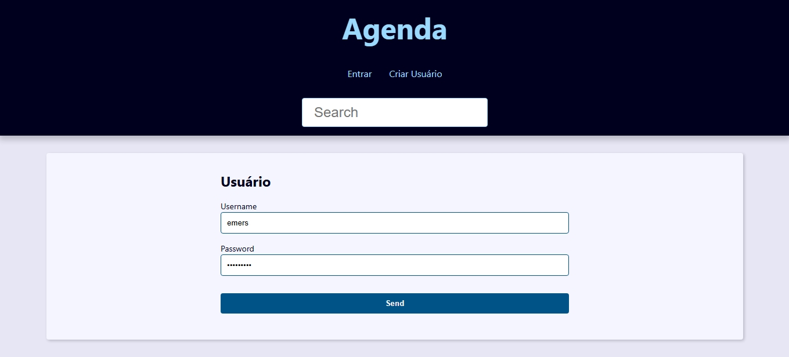
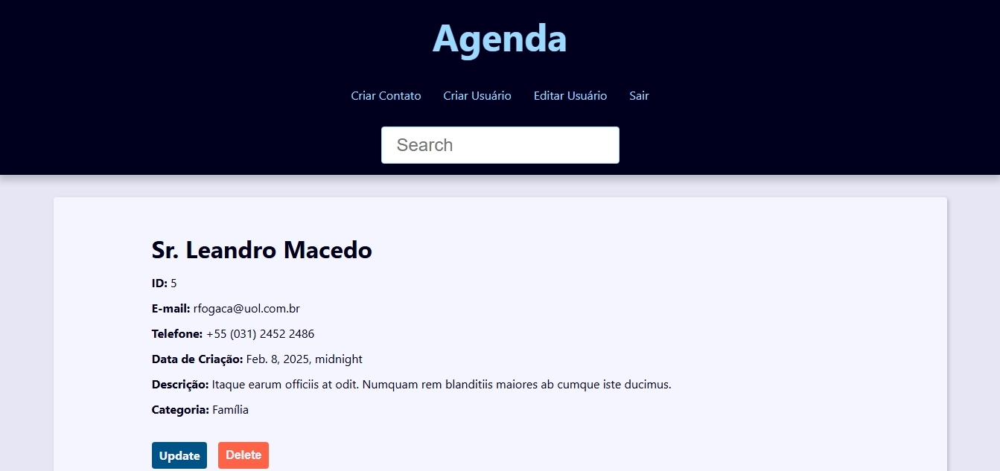

<h1>Projeto Agenda Com o Framework Django</h1>
<h3></h3>
  

Estou fazendo este projeto no curso de Python de <a href="https://github.com/luizomf" style="color:dodgerblu">luizomf</a>. <a href="https://github.com/luizomf/agenda-curso-python">Seu repositório</a>.

 <figcaption>Tela página inicial da Agenda, em trabalho.</figcaption> 
 
 <figcaption>Tela de criação de contato, em fase inicial com validação <i>server-side</i>.</figcaption> 
 

 <figcaption>Tela de criação de contato agora com validação <i>client-side</i>.</figcaption> 
 
 <figcaption>Tela de login.</figcaption> 
 
 <figcaption>Tela de visualização de contato, com as opções: deletar e alterar.</figcaption> 
 