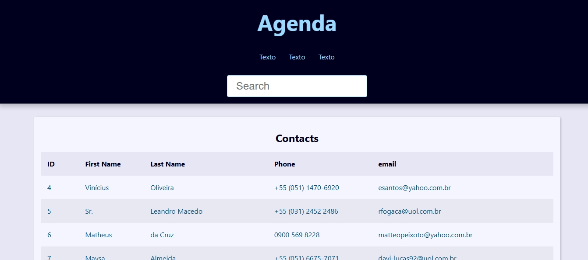
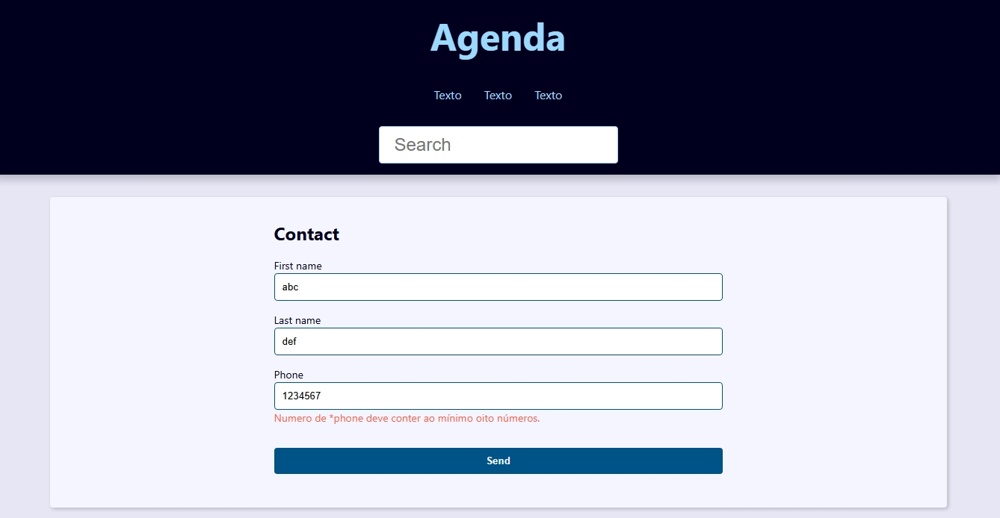

<h1>Projeto Agenda</h1>
<h3>Com o framework Django</h3>
  

Estou fazendo este projeto junto ao curso de Python de <a href="https://github.com/luizomf" style="color:dodgerblu">luizomf</a>.

 

<figcaption>
Imagem da tela página inicial da Agenda, em trabalho.
</figcaption>

<figcaption>
Imagem da tela de criação de contato, em fase inicial, apresentando um erro reconhecido por validação de form <i>server-side</i>.
</figcaption>

